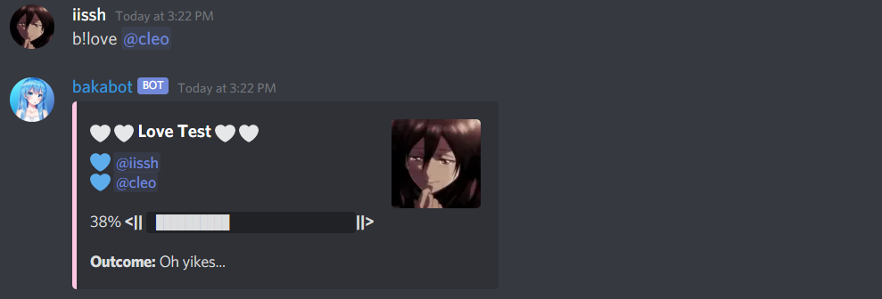
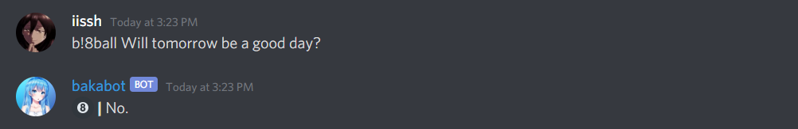

# bakabot Discord Bot
A multipurpose Discord Bot created to support gaming communities on Discord. Currently, bakabot is in multiple servers with over 2000 users. I created this project using Javascript (particularly Node.js), Discord.js, Puppeteer (web scraping), and Jimp (image manipulation).

## How to use bakabot
bakabot comes with a wide variety of commands. Below are all the commands that are available. All commands produce the information in a readable message to users using the Discord.js API.

### ` b!lol`
Displays the Summoner Profile for the user provided. The command must be used in the form of `b!lol <region> <summoner>`. This command uses the Puppeteer Node library to webscrape three websites to collect all the information needed to create the LoL profile.

### ` b!jail`
Displays the user's profile picture under jail bars. Oh no! Looks like they've been jailed! This command uses the Jimp Node library to put the image of the jail bars on top of a user's profile using image manipulation. <br/>


### ` b!meme`
Displays a random meme. <br/>


### ` b!love`
Produces the compatibility percentage between two people. Command can be used as **`b!love @<some user>`** or **`b!love @<some user> @<some other user>`**.


### ` b!simprate`
Produces a simp percentage for the user. Command can also be used as **`b!simprate @<some user>`** to determine another user's simp percentage.<br/>


### ` b!8ball`
Says an answer from 8ball based on the statement or question provided. <br/>


### ` b!ping`
bakabot replies with "pong". <br/>


### ` b!help`
Displays the list of commands that bakabot offers. <br/>


### Prerequisites for Downloading Bot Files
You will need to install the following things before you can run the bot
```
Node.js
Discord.js
Puppeteer
Jimp
```
To install `Discord.js`, `Puppeteer`, and `Jimp`. You should navigate to the folder containing this bot and run the following commands.
```
npm install discord.js
npm install puppeteer
npm install jimp
```


## Built With

* [Node.js](https://nodejs.org/en/) - the base that the bot runs on
* [discord.js](https://discord.js.org/#/) - node.js link to the discord bot api
