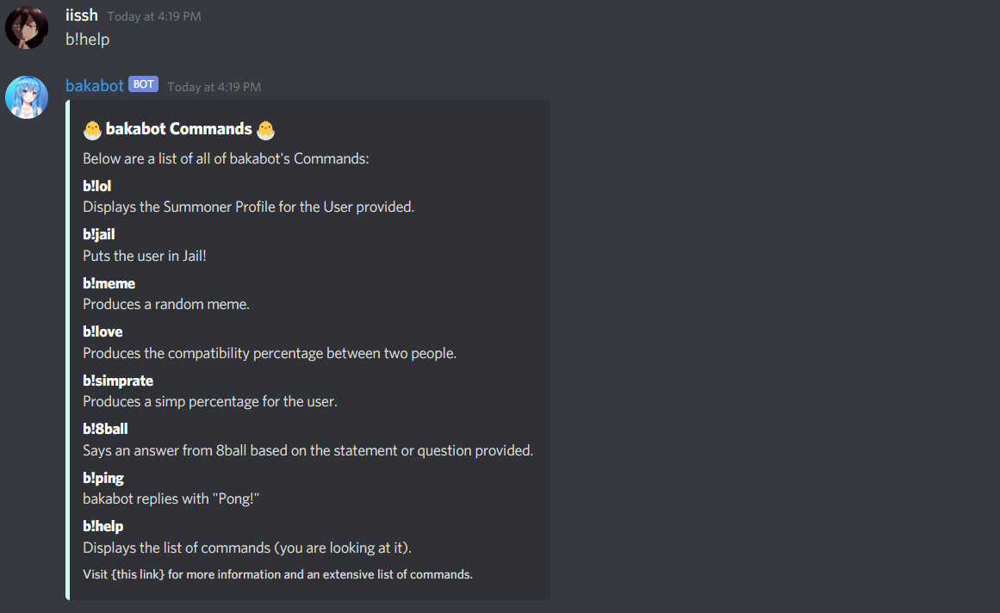

# bakabot Discord Bot
A multipurpose Discord Bot created to support gaming communities on Discord. Currently, bakabot is in multiple servers with over 2000 users. I created this project using Javascript (particularly Node.js), Discord.js, Puppeteer (web scraping), and Jimp (image manipulation).

## How to use bakabot
bakabot comes with a wide variety of commands. Below are all the commands that are available.

### ` b!lol`
Displays the Summoner Profile for the user provided. Works for most regions. The command must be used in the form of `b!lol <region> <summoner>`. <br/>

### ` b!jail`

### ` b!meme`

### ` b!love`
### ` b!simprate`
### ` b!8ball`
### ` b!ping`
bakabot replies with "Pong!". <br/>

### ` b!help`
Displays the list of commands that bakabot offers. <br/>

### Prerequisites for Downloading Bot Files
You will need to install the following things before you can run the bot
```
Node.js
Discord.js
Puppeteer
Jimp
```
To install `Discord.js`, `Puppeteer`, and `Jimp`. You should navigate to the folder containing this bot and run the following commands.
```
npm install discord.js
npm install puppeteer
npm install jimp
```


## Built With

* [Node.js](https://nodejs.org/en/) - the base that the bot runs on
* [discord.js](https://discord.js.org/#/) - node.js link to the discord bot api
